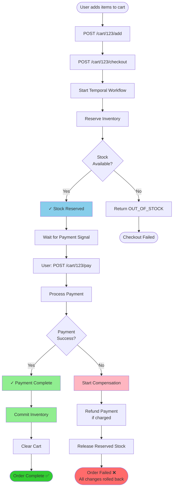

## Order Workflow: 
1. Add product to cart 
2. Checkout → Start workflow 
3. Check inventory, reserve stocks
4. Wait for payment process  
5. User process payment for order. If success update inventory and remove current cart. 
6. If we fail at any step, release stock → Orchestrator rollbacks & compensates previous steps 

## Workflow Diagram:

## Recording Scenarios
### Scenario 1: Happy Case 
1. User adds products to cart
2. User checkouts
3. User processes payment within the reservation time
4. Done

### Scenario 2: Reservation Timeout
1. User add products to cart
2. User checkouts
3. User does not process payment within the reservation time
4. Done

### Scenario 3: Internet Connection Interrupted
1. User add products to cart
2. User checkouts
3. User processes payment but get disconnected due to network issues
4. Temporal performs retries
5. Retry successful
6. Done

### Scenario 4: Out of stock
1. User add products to cart
2. User checkouts
3. Temporal check available stocks from inventory service
4. Inform "Out of stock"
5. Done
